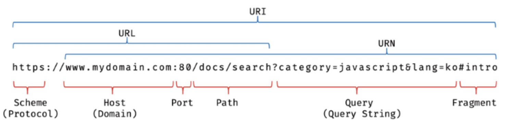
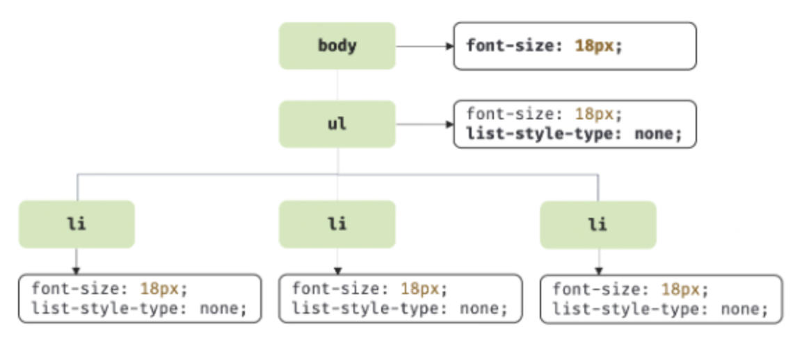
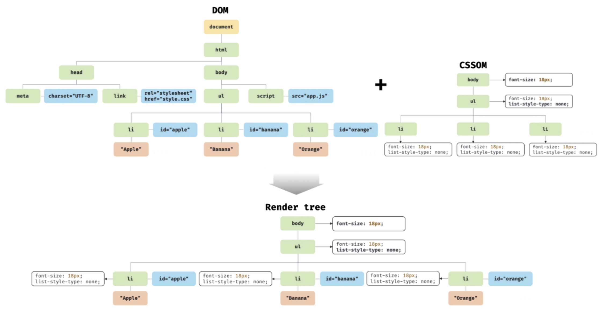

# 38장 브라우저의 렌더링 과정

- 구글의 V8 자바스크립트 엔진으로 빌드된 자바스크립트 런타임 환경인 Node.js의 등장으로 자바스크립트는 웹 브라우저를 벗어나 서버 사이드 애플리케이션 개발에서도 사용할 수 있는 범용 개발 언어가 되었다.
- 하지만 자바스크립트가 가장 많이 사용되는 분야는 역시 웹 브라우저 환경에서 동작하는 웹페이지/애플리케이션의 클라이언트 사이드다.
- 대부분의 프로그래밍 언어는 운영체제나 가상 머신 위에서 실행되지만 웹 애플리케이션의 클라이언트 사이드 자바스크립트는 브라우저에서 HTML, CSS와 함께 실행된다.
- 따라서 브라우저 환경을 고려할 때 더 효율적인 클라이언트 사이드 자바스크립트 프로그래밍이 가능하다.

- 간략하게 표현된 브라우저 렌더링 과정
  
  1. 브라우저는 HTML, CSS, 자바스크립트, 이미지, 폰트 파일 등 렌더링에 필요한 리소스를 요청하고 서버로부터 응답을 받는다.
  2. 브라우저의 렌더링 엔진은 서버로부터 응답된 HTML과 CSS를 파싱하여 DOM과 CSSOM을 생성하고 이들을 결합하여 렌더 트리를 생성한다.
  3. 브라우저의 자바스크립트 엔진은 서버로부터 응답된 자바스크립트를 파싱하여 AST(Abstract Syntax Tree)를 생성하고 바이트코드로 변환하여 실행한다. 이때 자바스크립트는 DOM API를 통해 DOM이나 CSSOM을 변경할 수 있다. 변경된 DOM과 CSSOM은 다시 렌더 트리로 결합된다.
  4. 렌더 트리를 기반으로 HTML 요소의 레이아웃(위치와 크기)을 계산하고 브라우저 화면에 HTML 요소를 페인팅한다.

## 목차

- [요청과 응답](#38.1)
- [HTTP 1.1과 HTTP 2.0](#38.2)
- [HTML 파싱과 DOM 생성](#38.3)
- [CSS 파싱과 CSSOM 생성](#38.4)
- [렌더 트리 생성](#38.5)
- [자바스크립트 파싱과 실행](#38.6)
- [리플로우와 리페인트](#38.7)
- [자바스크립트 파싱에 의한 HTML 파싱 중단](#38.8)
- [script 태그의 async/defer 어트리뷰트](#38.9)

## 38.1 요청과 응답 <a name= "38.1"></a>

- 브라우저의 핵심 기능은 필요한 리소스(HTML, CSS, 자바스크립트, 이미지, 폰트 등의 정적 파일 또는 서버가 동적으로 생성한 데이터)를 서버에 요청하고 서버로부터 응답받아 브라우저에 시각적으로 렌더링하는 것이다.
- 서버에 요청을 전송하기 위해 브라우저는 주소창을 제공한다.
- 브라우저의 주소창에 URL을 입력하고 엔터 키를 누르면 URL의 호스트 이름이 DNS를 통해 IP 주소로 변환되고 이 IP 주소를 갖는 서버에게 요청을 전송한다.
- URI 
- 일반적으로 서버는 루트 요청에 대해 index.html을 응답하도록 설정되어 있다.

## 38.2 HTTP 1.1과 HTTP 2.0 <a name= "38.2"></a>

- HTTP는 웹에서 브라우저와 서버가 통신하기 위한 프로토콜(규약)이다.
- HTTP/1.1
  - 기본적으로 커넥션당 하나의 요청과 응답만 처리한다.
  - 즉, 여러 개의 요청을 한 번에 전송할 수 없고 응답 또한 마찬가지다. 따라서 HTML 문서 내에 포함된 여러 개의 리소스 요청, 즉 CSS 파일을 로드하는 link 태그, 이미지 파일을 로드하는 img 태그, 자바스크립트를 로드하는 script 태그 등에 의한 리소스 요청이 개별적으로 전송되고 응답 또한 개별적으로 전송된다.
  - 이처럼 HTTP/1.1은 리소스의 동시 전송이 불가능한 구조이므로 요청할 리소스의 개수에 비례하여 응답 시간도 증가하는 단점이 있다.
- HTTP/2.0
  - 커넥션당 여러 개의 요청과 응답, 즉, 다중 요청/응답이 가능하다.
  - 따라서 HTTP/2.0은 여러 리소스의 동시 전송이 가능하므로 HTTP/1.1에 비해 페이지 로드 속도가 약 50% 정도 빠르다고 알려져 있다.

## 38.3 HTML 파싱과 DOM 생성 <a name= "38.3"></a>

- 브라우저의 렌더링 엔진은 아래 그림과 같은 과정을 통해 응답받은 HTML 문서를 파싱하여 브라우저가 이해할 수 있는 자료구조인 DOM(Document Object Model)을 생성한다.
- HTML 파싱과 DOM 생성 
  1. 서버에 존재하던 HTML 파일이 브라우저의 요청에 의해 응답된다
  2. 서버는 브라우저가 요청한 HTML 파일을 읽어 메모리에 저장한 다음 메모리에 저장된 바이트(2진수)를 인터넷을 경유하여 응답한다.
  3. 브라우저는 서버가 응답한 HTML 문서를 바이트(2진수) 형태로 응답받는다.
  4. 바이트 형태의 HTML 문서는 meta 태그의 charset 어트리뷰트에 의해 지정된 인코딩 방식(ex: UTF-8)을 기준으로 문자열로 변환된다.
  5. 문자열로 변환된 HTML 문서를 읽어 들여 의미를 갖는 코드의 최소 단위인 토큰들로 분해한다.
  6. 각 토큰들을 객체로 변환하여 노드를 생성한다.
  7. 토큰의 내용에 따라 문서, 요소, 어트리뷰트, 텍스트 노드가 생성된다. 노드는 이후 DOM을 구성하는 기본 요소가 된다.
  8. HTML 문서는 HTML 요소들의 집합으로 이루어지며 HTML 요소는 중첩 관계를 갖는다.
  9. 즉, HTML 요소의 콘텐츠 영역(시작 태그와 종료 태그 사이)에는 텍스트뿐만 아니라 다른 HTML 요소도 포함될 수 있다. 이때 HTML 요소 간에는 중첩 관계에 의해 부자 관계가 형성된다.
  10. 이러한 HTML 요소 간의 부자 관계를 반영하여 모든 노드들을 트리 자료구조로 구성한다.
  11. 이 노드들로 구성된 트리 자료구조를 DOM이라 부른다.

## 38.4 CSS 파싱과 CSSOM 생성 <a name= "38.4"></a>

- 렌더링 엔진은 HTML을 처음부터 한 줄씩 순차적으로 파싱하여 DOM을 생성해 나간다
- DOM을 생성해 나가다가 CSS를 로드하는 link 태그나 style 태그를 만나면 DOM 생성을 일시 중단한다.
- 그리고 link 태그의 href 어티리뷰트에 지정된 CSS 파일을 서버에 요청하여 로드한다.
- 로드한 CSS 파일이나 style 태그 내의 CSS를 HTML과 동일한 파싱 과정(바이트 -> 문자 -> 토큰 -> 노드 -> CSSOM)을 거치며 해석하여 CSSOM(CSS Object Model)을 생성한다.
- 이후 CSS 파싱을 완료하면 HTML 파싱이 중단된 지점부터 다시 HTML을 파싱하기 시작하여 DOM 생성을 재개한다.
- CSSOM은 CSS의 상속을 반영하여 생성된다. 

## 38.5 렌더 트리 생성 <a name= "38.5"></a>

- 렌더링 엔진은 서버로부터 응답된 HTML과 CSS를 파싱하여 각각 DOM과 CSSOM을 생성한다.
- 그리고 DOM과 CSSOM은 렌더링을 위해 렌더(render tree)로 결합된다.
- 렌더 트리는 렌더링을 위한 트리 구조의 자료구조다.
- 따라서 브라우저 화면에 렌더링되지 않는 노드(meta 태그, script 태그 등)와 CSS에 비표시(ex: display: none)되는 노드들은 포함되지 않는다.
- 즉, 렌더 트리는 브라우저 화면에 렌더링되는 노드만으로 구성된다.
- 렌더 트리 생성 
- 완성된 렌더 트리는 각 HTML 요소의 레이아웃(위치와 크기)을 계산하는 데 사용되며 브라우저 화면에 픽셀을 렌더링하는 페인팅 처리에 입력된다.
- 렌더 트리와 레이아웃/페인트 
- 브라우저 렌더링 과정은 반복해서 실행될 수 있다. 예를 들어, 다음과 같은 경우 반복해서 레이아웃 계산과 페인팅이 재차 실행된다.
  - 자바스크립트에 의한 노드 추가 또는 삭제
  - 브라우저 창의 리사이징에 의한 뷰포트 크기 변경
  - HTML 요소의 레이아웃(위치, 크기)에 변경을 발생시키는 width/height, margin, padding, border, dislplay, position, top/right/bottom/left 등의 스타일 변경
- 레이아웃 계산과 페인팅을 다시 실행하는 리렌더링은 비용이 많이 드는, 성능에 악영향을 주는 작업이므로 리렌더링이 빈번하게 발생하지 않도록 주의할 필요가 있다.

## 38.6 자바스크립트 파싱과 실행 <a name= "38.6"></a>

- HTML 문서를 파싱한 결과물로서 생성된 DOM은 HTML 문서의 구조와 정보뿐만 아니라 HTML 요소와 스타일 등을 변경할 수 있는 프로그래밍 인터페이스로서 DOM API를 제공한다.
- 즉, 자바스크립트 코드에서 DOM API를 사용하면 이미 생성된 DOM을 동적으로 조작할 수 있다.
- CSS 파싱과 마찬가지로 렌더링 엔진은 HTML을 한 줄씩 순차적으로 파싱하며 DOM을 생성해 나가다가 자바스크립트 파일을 로드하는 script 태그나 자바스크립트 코드를 콘텐츠로 담은 script 태그를 만나면 DOM 생성을 일시 중단한다.
- 그리고 script 태그의 src 어트리뷰트에 정의된 자바스크립트 파일을 서버에 요청하여 로드한 자바스크립트 파일이나 script 태그 내의 자바스크립트 코드를 파싱하기 위해 자바스크립트 엔진에 제어권을 넘긴다.
- 이후 자바스크립트 파싱과 실행이 종료되면 렌더링 엔진으로 다시 제어권을 넘겨 HTML 파싱이 중단된 지점부터 다시 HTML 파싱을 시작하여 DOM 생성을 재개한다.
- 자바스크립트 파싱과 실행은 브라우저의 렌더링 엔진이 아닌 자바스크립트 엔진이 처리한다.
- 자바스크립트 엔진은 자바스크립트 코드를 파싱하여 CPU가 이해할 수 있는 저수준 언어로 변환하고 실행하는 역할을 한다.
- 자바스크립트 엔진은 브라우저별로 다양한 종류가 있다(Node.js의 V8, SpiderMonkey, JavaScriptCore 등)
- 모든 자바스크립트 엔진은 ECMAScript 사양을 준수한다.
- 렌더링 엔진으로부터 제어권을 넘겨받은 자바스크립트 엔진은 자바스크립트 코드를 파싱하기 시작한다.
- 렌더링 엔진이 HTML, CSS를 파싱하여 DOM과 CSSOM을 생성하듯이 자바스크립트 엔진은 자바스크립트를 해석하여 AST(Abstract Syntax Tree)(추상적 구문 트리)를 생성한다.
- 그리고 AST를 기반으로 인터프리터가 실행할 수 있는 중간 코드인 바이트코드를 생성하여 실행한다.
- 자바스크립트 파싱과 실행 

## 38.7 리플로우와 리페인트 <a name= "38.7"></a>

- 자바스크립트 코드에 DOM이나 CSSOM을 변경하는 DOM API가 사용된 경우 DOM이나 CSSOM이 변경된다.
- 이때 변경된 DOM과 CSSOM은 다시 렌더 트리로 결합되고 변경된 렌더 트리를 기반으로 레이아웃 페인트 과정으 거쳐 브라우저의 화면에 다시 렌더링한다.
- 이를 리플로우, 리페인트라 한다.
- DOM API에 의한 리플로우, 리페인트
  
- 리플로우
  - 레이아웃 계산을 다시 하는 것을 말한다
  - 노드 추가/삭제, 요소의 크기/위치 변경, 윈도우 리사이징 등 레이아웃에 영향을 주는 변경이 발생한 경우에 한하여 실행된다
  - 한 요소의 레이아웃 변화가 그 부모 요소나 형제 요소들에 영향을 주기 때문에, 전체 페이지의 레이아웃을 다시 계산해야 하는 상황도 발생할 수 있는 성능에 영향을 크게 미칠 수 있는 작업이다.
- 리페인트
  - 화면에 렌더링된 요소의 색상, 배경 등 시각적 속성이 변경될 때, 다시 화면에 그리는 작업을 의미한다.
  - 재결합된 렌더 트리를 기반으로 다시 페인트를 하는 것을 말한다
- 따라서 리플로우와 리페인트가 반드시 순차적으로 동시에 실행되는 것은 아니고 레이아웃에 영향이 없는 변경은 리플로우 없이 리페인트만 실행된다.

## 38.8 자바스크립트 파싱에 의한 HTML 파싱 중단 <a name= "38.8"></a>

- 렌더링 엔진과 자바스크립트 엔진은 병렬적으로 파싱을 실행하지 않고 직렬적으로 파싱을 수행한다
- 브라우저는 동기적으로 위에서 아래 방향으로 HTML, CSS, 자바스크립트를 파싱하고 실행한다. 이것은 script 태그의 위치에 따라 HTML 파싱이 블로킹되어 DOM 생성이 지연될 수 있다는 것을 의미한다
- 만약 자바스크립트 코드에서 DOM이나 CSSOM을 변경하는 DOM API를 사용할 경우 DOM이나 CSSOM이 이미 생성되어 있어야 한다. 만약 생성되기 전에 DOM API를 사용할 경우 문제가 발생할 수 있다.
- 이러한 문제를 해결하기 위해 body 태그 아래에 script 태그를 사용하거나 defer 또는 async 속성을 사용하는 것을 고려할 수 있다.

## 38.9 script 태그의 async/defer 어트리뷰트 <a name= "38.9"></a>

- 자바스크립트 파싱에 의한 DOM 생성이 중단되는 문제를 근본적으로 해결하기 위해 HTML5부터 script 태그에 async와 defer 어트리뷰트가 추가되었다.
- async와 defer 어트리뷰트는 src 어트리뷰트를 통해 외부 자바스크립트 파일을 로드하는 경우에만 사용할 수 있다.
  ```html
  <script async src="test.js"></script>
  <script defer src="test.js"></script>
  ```
- async와 defer 어트리뷰트를 사용하면 HTML 파싱과 외부 자바스크립트 파일의 로드가 비동기적으로 동시에 진행된다
- async 
  - 자바스크립트의 파싱과 실행은 자바스크립트 파일의 로드가 완료된 직후 진행되며, 이때 HTML 파싱이 중단된다.
  - 여러 개의 script 태그에 async 어트리뷰트를 지정하면 script 태그의 순서와는 상관없이 로드가 완료된 자바스크립트부터 먼저 실행되므로 순서가 보장되지 않는다.
- defer 
  - 자바스크립트의 파싱과 실행은 HTML 파싱이 완료된 직후, 즉 DOM 생성이 완료된 직후(이때 DOMContentLoaded 이벤트가 발생한다) 진행된다.
  - 따라서 DOM 생성이 완료된 이후 실행되어야 할 자바스크립트에 유용하다.
