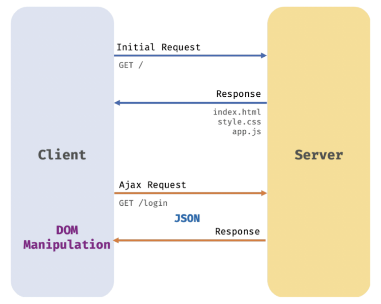

# 43장 Ajax

## 목차

- [Ajax란?](#43.1)
- [JSON](#43.2)
- [XMLHttpRequest](#43.3)

## 43.1 Ajax란? <a name= "43.1"></a>

- 자바스크립트를 사용하여 브라우저가 서버에게 비동기 방식으로 데이터를 요청하고, 서버가 응답한 데이터를 수신하여 웹페이지를 동적으로 갱신하는 프로그래밍 방식을 말한다.
- 브라우저에서 제공하는 Web API인 XMLHttpRequest 객체를 기반으로 동작한다.
- XMLHttpRequest는 HTTP 비동기 통신을 위한 메서드와 프로퍼티를 제공한다.
- Ajax를 전통적인 방식과 비교했을 때 장점 3가지
  
  1. 변경할 부분을 갱신하는 데 필요한 데이터만 서버로부터 전송받기 떄문에 불필요한 데이터 통신이 발생하지 않는다.
  2. 변경할 필요가 없는 부분은 다시 렌더링하지 않는다. 따라서 화면이 순간적으로 깜빡이는 현상이 발생하지 않는다.
  3. 클라이언트와 서버와의 통신이 비동기 방식으로 동작하기 때문에 서버에게 요청을 보낸 이후 블로킹이 발생하지 않는다.

## 43.2 JSON <a name= "43.2"></a>

- 클라이언트와 서버 간의 HTTP 통신을 위한 텍스트 데이터 포맷
- 자바스크립트에 종속되지 않는 언어 독립형 데이터 포맷으로, 대부분의 프로그래밍 언어에서 사용할 수 있다.

### 43.2.1 JSON 표기 방식

```json
{
  "name": "An",
  "age": 28,
  "alive": true
}
```

- 키와 값으로 구성된 텍스트
- 키는 반드시 큰따움표(작은따움표 사용 불가)로 묶어야 한다.
- 값은 객체 리터럴과 같은 표기법을 그대로 사용할 수있다.
- 하지만 문자열은 반드시 큰따움표(작은따움표 사용 불가)로 묶어야 한다.

### 43.2.2 JSON stringify

- 객체를 JSON 포맷의 문자열로 변환한다.
- 클라이언트가 서버로 객체를 전송하려면 객체를 문자열화해야 하는데 이를 직렬화라 한다.
- 두 번째 인수로 replacer 함수를 전달할 수 있다.
- 객체뿐만 아니라 배열도 JSON 포맷의 문자열로 변환한다

```js
const obj = {
  name: 'An',
  age: 28,
  alive: true,
};

let json = JSON.stringify(obj);
console.log(typeof json, json); // string {"name":"An","age":28,"alive":true}

const todos = [
  { id: 1, content: 'HTML' },
  { id: 2, content: 'CSS' },
  { id: 3, content: 'JavaScript' },
];

json = JSON.stringify(todos);
console.log(typeof json, json); // string [{"id":1,"content":"HTML"},{"id":2,"content":"CSS"},{"id":3,"content":"JavaScript"}]
```

### 43.2.3 JSON parse

- JSON 포맷의 문자열을 객체로 변환한다.
- 서버로부터 클라이언트에게 전송된 JSON 데이터는 문자열이다.
- 이 문자열을 객체로서 사용하려면 JSON 포맷의 문자열을 객체화해야 하는데 이를 역직렬화라 한다.

```js
const obj = {
  name: 'An',
  age: 28,
  alive: true,
};

let json = JSON.stringify(obj);

let parsed = JSON.parse(json);
console.log(typeof parsed, parsed); // object {name: 'An', age: 28, alive: true}

const todos = [
  { id: 1, content: 'HTML' },
  { id: 2, content: 'CSS' },
  { id: 3, content: 'JavaScript' },
];
json = JSON.stringify(todos);

parsed = JSON.parse(json);
console.log(typeof parsed, parsed);
/*
  object [
    { id: 1, content: 'HTML' },
    { id: 2, content: 'CSS' },
    { id: 3, content: 'JavaScript' },
  ]
*/
```

## 43.3 XMLHttpRequest <a name= "43.3"></a>

- 브라우저는 주소창이나 HTML의 from 태그 또는 a 태그를 통해 HTTP 요청 전송 기능을 기본 제공한다.
- 자바스크립트를 사용하여 HTTP 요청을 전송하려면 XMLHttpRequest 객체를 사용한다.
- Web API인 XMLHttpRequest 객체는 HTTP 요청 전송과 HTTP 응답 수신을 위한 다양한 메서드와 프로퍼티를 제공한다.

### 43.3.1 XMLHttpRequest 객체 생성

- 생성자 함수를 호출하여 생성한다.
- 브라우저에서 제공하는 Web API이므로 브라우저 환경에서만 정상적으로 실행된다.

```js
const xhr = new XMLHttpRequest();
```

### 43.3.2 XMLHttpRequest 객체의 프로퍼티와 메서드

- 다양한 프로퍼티와 메서드를 제공한다
  - 프로토타입 프로퍼티
  - 이벤트 핸들러 프로퍼티
  - 메서드
  - 정적 프로퍼티

### 43.3.3 HTTP 요청 전송

- HTTP 요청을 전송하는 경우 순서

  1. XMLHttpRequest.prototype.open 메서드로 HTTP 요청을 초기화
  2. 필요에 따라 XMLHttpRequest.prototype.setRequestHeader 메서드로 특정 HTTP 요청의 헤더 값을 설정
  3. XMLHttpRequest.prototype.send 메서드로 HTTP 요청을 전송

  ```js
  const xhr = new XMLHttpRequest();

  xhr.open('GET', '/users');

  xhr.setRequestHeader('content-type', 'application/json');

  xhr.send();
  ```

### 43.3.4 HTTP 응답 처리

- 서버가 전송한 응답을 처리하려면 XMLHttpRequest 객체가 발생시키는 이벤트를 캐치해야 한다.
- 서버의 응답이 완료되면 응답 상태 코드를 확인하여 처리한다.
